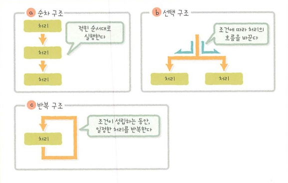

[ 19.11.22 ]

> 알고리즘 학습은 우수한 프로그램을 작성하기 위한 이정표이며, 
> 좋은 알고리즘은 프로그램 작성의 좋은 본보기입니다. 
> 제대로 동작하면서도 효율적인 프로그램을 작성하려면 필수적으로 알고리즘 학습이 필요합니다.

 

# 제 1장. 알고리즘이란
## 알고리즘(Algorithm)
컴퓨터를 이용하여 문제를 해결하기 위한 처리 절차

많은 연구자들이 
  * 보다 일반적인 처리 절차는 없는지, 
  * 보다 빠르게 처리할 수는 없는지, 
  * 보다 데이터 양을 낮출 수 있는 절차는 없는지

등을 고려하여 지금까지 등장한 알고리즘들을 개량

 

### [ 알고리즘에서 충족시켜야할 조건 ]

1. 정당성
: 입력값이 지정된 조건과 일치한다면 알고리즘은 반드시 정상적인 동작(올바른 출력값의 반환)을 보장해야 한다.
   * 증명방법 
   단정문(Assertion): 알고리즘의 실행 순서 중 임의의 위치에 서서 충족해야 하는 조건이 성립하는지의 여부(올바르게 동작하는지의 여부)를 체크 하는 것.

2. 정지성
 : 어떠한 조건의 입력값이 주어지더라도 정해진 시간 내에 반드시 정상적인 종료를 보장해야 한다.
    * 증명 방법 
    반복 처리의 종료 조건 체크에 사용되는 변수를 관찰하여 정해진 횟수만큼 반복하면 반드시 정지하는 것.

== 정해진 시간 내에 정확한 결과를 얻어야 한다.
   
  

  
## 알고리즘의 종류
컴퓨터 프로그래밍을 할 때 알아두면 편리한 알고리즘
* 기술 계산
  1. 유클리드 호제법(최대공약수)
  2. 가우스 소거법(방정식)
  3. 사다리꼴의 법칙(정적분)
  4. 데이크스트라 알고리즘(최적경로)
  5. 에라토스테네스의 체(소수)
* 정렬(Sort)
  1. 단순 선택 정렬
  2. 단순 교환 정렬(버블 정렬)
  3. 단순 삽입 정렬
  4. 셀 정렬
  5. 병합 정렬
  6. 퀵 정렬
* 검색(Search)
  1. 선형 검색(리니어 서치)
  2. 이진 검색(바이너리 서치)
* 문자열 패턴 매칭
  1. 단순 문자열 일치
  2. KMP 알고리즘
  3. BM 알고리즘

 

## 알고리즘 예시
* 음식 요리법

  * 치킨 카레 만들기
    > [ 레시피 ] == 알고리즘
    > 1. 조리단계
    > 2. 조리단계
    > 3. 조리단계

  * 치킨카레 완성!

 

***

## [ COLUMN ]
### 구조적 프로그래밍
: 프로그램을 효율적으로 작성하고, 설계상의 오류를 최소화하기 위한 방법론
* 프로세스 흐름
  * 순차 구조: 작성된 순서대로 순차실행
  * 선택 구조: 조건에 따라 수행할 작업의 흐름 변경
  * 반복 구조: 조건이 일치하는 동안 일정 과정 반복 실행

