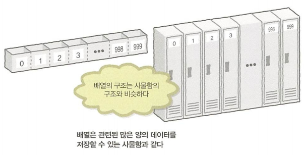
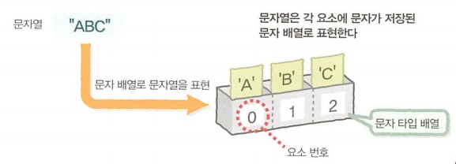
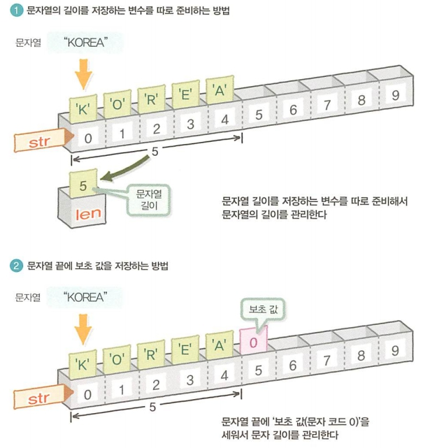
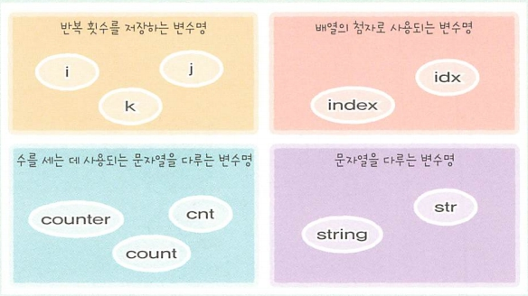

[ 19.12.06 ]

> 알고리즘이 문제를 처리할 때, 데이터의 형태로 입력되고 출력됩니다.
> 처리 과정에서 데이터 유지와 관리가 필요하며, 이를 위해 변수와 배열을 학습합니다.

 

# 변수와 배열
* 데이터 == 다양한 정보 == 값
* 데이터 타입 == 데이터 분류

## 변수
데이터를 저장하는 공간
* 하나의 값만 저장 가능
* 값이 있는 변수에 새로운 값을 저장할 경우
  * 이전의 값 삭제
  * 새로운 값 저장
* 변수명
  * 다른 변수들과 구별하기 위한 수단 == 저장공간의 이름

### 변수 선언 (대입)
변수명 = 값 or 계산식
* 변수 = 변수2
  * 변수2에 저장된 값을 변수에 저장

### 변수명 규칙
* 변수명은 고유해야 함
  * 변수는 반드시 구별 가능해야 함
* 숫자만 or 숫자로 시작 불가능
  * 숫자 데이터(값)와 구별하기 위함

### 데이터 타입
* 정수 타입: only 정수
* 실수 타입: only 실수
* 문자 타입: only 문자 ("" or ''로 묶어서 표현)
* 문자열 타입: only 문자열 ("" or ''로 묶어서 표현)
* 논리 타입: only 논리 (참/거짓)
* **변수의 데이터 타입과 일치하는 데이터 타입의 값만 대입 가능**

### [ + 참고 ]
* 자바스크립트에서 데이터 타입은 프로그램이 처리되는 과정에서 자동으로 파악되므로, 같은 변수에 여러 타입의 값 대입 가능 ( [자바스크립트의 데이터 타입](https://developer.mozilla.org/ko/docs/Web/JavaScript/Data_structures) )

 

***

 

## 배열
같은 종류의 데이터(값)를 대량으로 저장하는 여러 개의 상자들을 1줄로 나열한 것
* 대량의 데이터를 한곳에 모아서 관리하기 위해 사용
* 배열명: 대량의 데이터(값)를 담는 '여러 개의 상자'에 붙이는 이름
* 배열 요소: 배열에서의 상자 하나하나
* 배열 요소 수: 배열에 존재하는 상자의 개수
* 요소 번호: 첫번째 배열 요소부터 마지막 배열 요소까지의 연속된 일련번호, 요소 식별 번호
  * 첫번째 배열 요소의 요소번호는 0

### 배열명의 철칙
* 배열명은 고유해야 함
* 숫자 이름과 숫자로 시작하는 이름은 사용 불가

### 배열 요소 지정 방법
배열명[요소번호] or 배열명(요소번호)
* 첨자: 배열 요소 지정할 때의 요소번호

### 다차원 배열
* 이차원 배열: 가로(행), 세로(열)
  * 배열 요소 = '행'과 '열'의 요소 번호 교차점
  * 배열명[행 요소 번호][열 요소 번호] or 배열명(행 요소 번호)(열 요소 번호)
  * 배열명[행 요소 번호, 열 요소 번호] or 배열명(행 요소 번호, 열 요소 번호)
* 삼차원 배열: 가로, 세로, 높이
* 다차원 배열: 이차원, 삼차원 .. 배열과 같은 배열

### 배열에서의 문자열
각 요소에 문자가 저장된 문자 배열

배열에 저장된 문자 데이터만으로는 그 배열의 몇번째 요소에서 문자열이 끝나는지 알 수 없음
* 해결 방법
  1. 문자열 길이 변수를 준비 
    : 배열 속 문자열의 길이를 정수 타입 변수에 저장
  2. 문자열 끝에 보초 값 저장 
    : 문자열의 구성 문자로 절대로 표시되지 않는 문자코드(= 보초 값)를 배열의 문자열 끝 요소 뒷부분에 저장
    (숫자 0을 사용하는 것이 일반적)

### [ + 참고 ]
* javascript에서의 배열
  * 인덱스(요소 번호)는 0부터 시작
  * 중첩 가능 (= 다차원 배열): 하나의 배열은 또 다른 배열을 요소로 포함 가능
  * 다차원 배열 지정 방법: [[행 요소 번호, 열 요소 번호]]
  * [자바스크립트에서의 배열](https://developer.mozilla.org/ko/docs/Web/JavaScript/Reference/Global_Objects/Array), [자바스크립트에서의 배열2](https://developer.mozilla.org/ko/docs/Web/JavaScript/Guide/Indexed_collections), [자바스크립에서의 다차원 배열](https://heedipro.tistory.com/144)
* javascript에서의 문자열
  * 문자열 원형과 String 객체 2가지 type이 존재 (string, object)
    * 문자열 원형: 문자열 리터럴(= 따옴표로 문자열 생성), String(= new 키워드 없이 호출 후 문자열 반환)
    * String 객체: new String(= new 키워드를 사용하여 호출 및 문자열 반환)
  * javascript는 자동적으로 원형을 String 객체로 변환하기 때문에, String 객체 메서드를 사용하여 원형문자열 생성 가능
  * javascript에서 문자열 원형에서 속성 및 메소드를 호출 할 경우, 자동으로 문자열 원형을 감싸고 속성 조회 or 메서드를 호출
  * [자바스크립트에서의 문자열](https://developer.mozilla.org/ko/docs/Web/JavaScript/Reference/Global_Objects/String#Syntax)

 

***

 

## [ COLUMN ]
### 관용적으로 사용되는 변수명
* 반복문의 반복 횟수를 저장하는 변수
  * **i** or **j** or **k**
* 배열 첨자로 사용되는 변수
  * **index** or **idx**
* 수를 세는 데 사용되는 변수
  * **counter** or **count** or **cnt**
* 문자열을 다루는 변수(배열)
  * **str** or **string**

