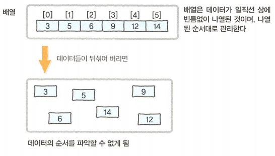
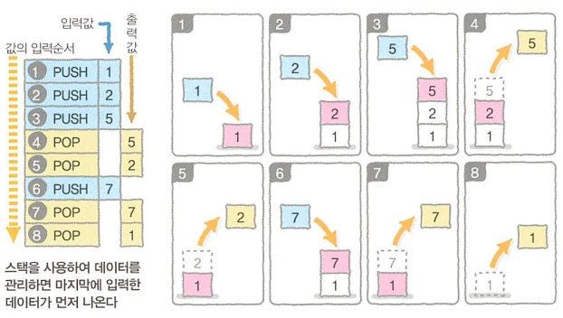
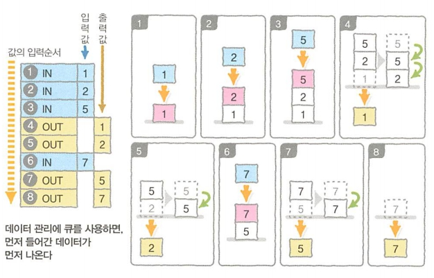
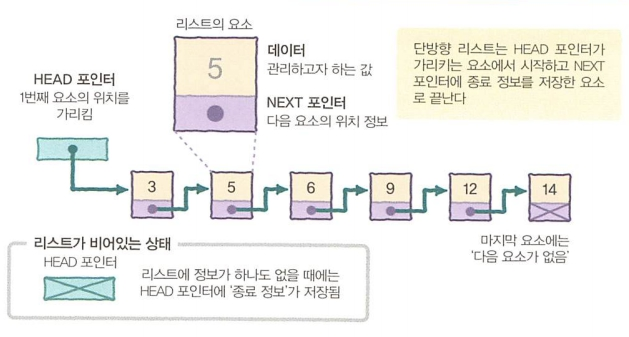
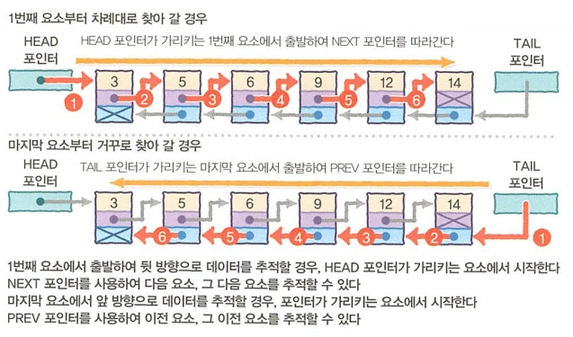
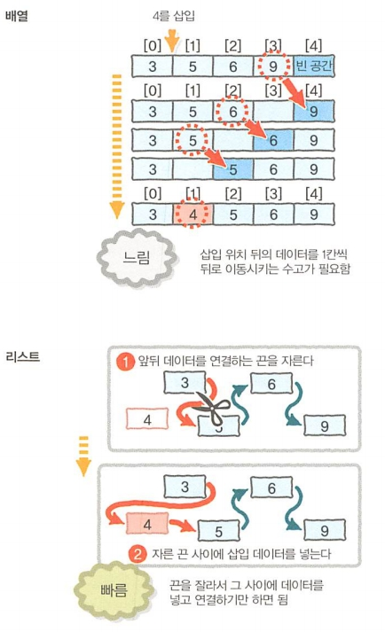

[ 19.11.22 ]

> 대량 데이터의 유지 관리 방법인 자료구조를 학습합니다.

 

# 제 3장. 자료구조
대량 데이터를 효율적으로 관리하는 매커니즘 

## 대표적인 자료구조
### 배열
데이터를 빈틈없이 나열한 자료구조  

  
### 스택(STACK)
데이터를 쌓아서 관리하는 방식

* PUSH: 데이터 넣기
* POP: 데이터 꺼내기
* LIFO(Last In, First Out) / FILO(First In, Last out): 마지막에 입력된 데이터가 먼저 출력 / 처음에 입력된 데이터가 마지막에 출력

 

### 큐(QUEUE, 대기 행렬)
먼저 입력한 데이터가 먼저 출력되는 특징을 가진 자료구조

* FIFO(First In, First Out) / LILO(Last In, Last Out): 먼저 입력한 데이터가 먼저 출력 / 마지막에 입력한 데이터가 마지막에 출력

 

### 리스트
배열과 같이 차례대로 나열한 데이터를 관리 
데이터들이 화살표로 서로 연결되어 있어 데이터들이 떨어진 장소에 위치 가능  

* 단방향 리스트
  * 앞쪽에서 뒷쪽을 가리키는 방향성을 가진 끈으로 순서가 있는 데이터를 연결하는 방식
  * 요소
    * 데이터 
    그 요소에 저장된 정수와 실수, 문자열 등 리스트에서 관리하고자 하는 값
    * 다음 요소를 가리키는 포인터 (== NEXT 포인터) 
      \- 요소와 요소를 연결하는 끈의 역할 
      \- 다음 요소가 어디에 있는지를 나타내는 위치 정보가 저장되어 있음 
      \- NEXT 포인터에는 다음 요소는 더이상 없다는 뜻의 종료 정보가 저장되어 있음
    * 첫번째를 가리키는 요소 (== HEAD 포인터) 
      \- 첫번째 요소의 위치 정보가 저장되어 있음
  * HEAD 포인터가 가리키는 요소에서 시작, NEXT 포인터가 종료 정보를 저장한 요소에서 끝
  * 데이터가 하나도 없을 경우: HEAD 포인터에 첫번째 요소가 없다는 정보를 저장  

  

* 양방향 리스트
  * 앞에서부터 뒤를 가리키는 끈과 뒤에서 앞을 가리키는 끈 2개를 사용하여 순서가 있는 데이터들을 연결하는 방법
  * 요소
    * 데이터 
    그 요소에 저장된 정수와 실수, 문자열 등 리스트에서 관리하고자 하는 값
    * 다음 요소를 가리키는 포인터 (== NEXT 포인터) 
    \- 다음 요소를 잇는 끈의 역할
    \- 다음 요소 없음의 종료 정보 저장
    * 이전 요소를 가리키는 포인터 (== PREV 포인터) 
    \- 이전 요소를 잇는 끈의 역할
    \- 다음 요소 없음의 종료 정보 저장
  * 첫번째 포인터를 가리키는 포인터 (== HEAD 포인터) 
    첫번째 요소의 위치 정보 저장
  * 마지막 포인터를 가리키는 포인터 (== TAIL 포인터) 
    마지막 요소의 위치 정보 저장
  * 데이터가 없을 경우 
    첫번째 요소 없음 정보 저장
  
  

  

> #### 배열과 리스트
> * 1차원 배열
>   * 차례대로 빈틈없이 나열
>   * 데이터를 저장하는 상자들이 정해진 위치에 있으므로 데이터의 순서 파악 가능한 구조
>   * 유효한 데이터의 개수 관리 시: 다른 변수를 사용
>   * N번째 요소의 참조가 빠름
>   * 데이터의 삽입, 삭제가 느림
> * 리스트
>   * 데이터들은 모두 떨어져 있지만, 끈으로 연결되어 있는 구조
>   * 데이터의 위치에 구애받지 않음
>   * 유효한 데이터 관리 시: 다음 데이터에 연결된 끈의 유무로 데이터의 끝 파악
>   * N번째 요소의 참조가 느림
>   * 데이터의 삽입, 삭제가 빠름
> * 배열과 리스트의 참조 비교
>   
> 
> * 배열과 리스트의 삽입 삭제 비교
>   

> #### 링 버퍼
> 배열의 마지막 요소와 첫번째 요소를 연결시킨 자료구조
  
### 트리(나무 구조)
나무 가지처럼 퍼져 나가는 자료구조  

* 이진 트리
* 힙

> #### 뿌리와 잎, 그리고 깊이
> * 뿌리: 부모 없는 노드
> * 잎: 자식 없는 노드
> * 깊이: 뿌리에서 특정 노드에 도달하기까지의 경로의 길이

### 해시 테이블

### 그래프

 

***

 

## [ COLUMN ]
### 배열의 첫번째 요소 번호 0과 1
0과 1 두개의 케이스가 존재하는 이유는 첫번째 요소의 번호를 0으로 정한 프로그래밍 언어와 1로 정한 프로그래밍 언어가 존재하기 때문

* 컴퓨터 개발 초창기의 프로그래밍에 자주 사용되던 언어들 (배열의 첫번째 요소 번호: 1)
  * Fortran
  * Pascal
  * Basic(초기형)
* 그 후 주류가 되어 지금도 널리 이용되는 프로그래밍 언어들 (배열의 첫번째 요소 번호: 0)
  * C
  * C++
  * Java
  * C#
  * VisualBasic(BASIC)