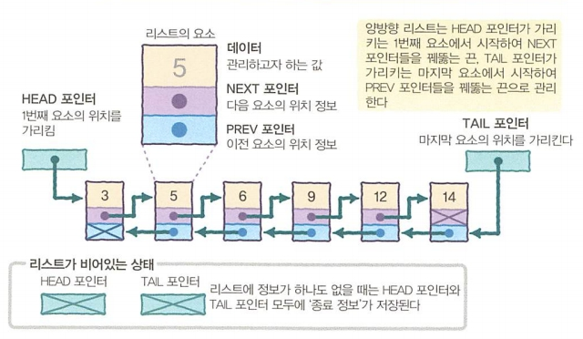
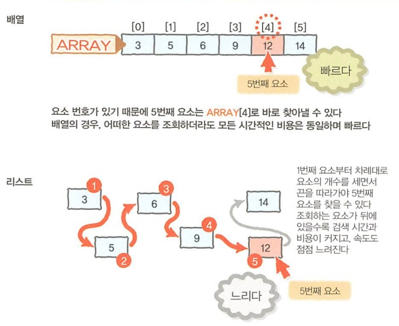

[ 19.11.22 ]

> 대량 데이터의 유지 관리 방법인 자료구조를 학습합니다.

 

# 제 3장. 자료구조
대량 데이터를 효율적으로 관리하는 매커니즘

 

## 대표적인 자료구조
### 배열
데이터를 빈틈없이 나열한 자료구조  

 

### 스택(STACK)
데이터를 쌓아서 관리하는 방식

* PUSH: 데이터 넣기
* POP: 데이터 꺼내기
* LIFO(Last In, First Out) / FILO(First In, Last out): 마지막에 입력된 데이터가 먼저 출력 / 처음에 입력된 데이터가 마지막에 출력

 

  

### 큐(QUEUE, 대기 행렬)
먼저 입력한 데이터가 먼저 출력되는 특징을 가진 자료구조

* FIFO(First In, First Out) / LILO(Last In, Last Out): 먼저 입력한 데이터가 먼저 출력 / 마지막에 입력한 데이터가 마지막에 출력 

  

### 리스트
배열과 같이 차례대로 나열한 데이터를 관리 
데이터들이 화살표로 서로 연결되어 있어 데이터들이 떨어진 장소에 위치 가능  

* 단방향 리스트
  * 앞쪽에서 뒷쪽을 가리키는 방향성을 가진 끈으로 순서가 있는 데이터를 연결하는 방식
  * 요소
    * 데이터 
    그 요소에 저장된 정수와 실수, 문자열 등 리스트에서 관리하고자 하는 값
    * 다음 요소를 가리키는 포인터 (== NEXT 포인터) 
      \- 요소와 요소를 연결하는 끈의 역할 
      \- 다음 요소가 어디에 있는지를 나타내는 위치 정보가 저장되어 있음 
      \- NEXT 포인터에는 다음 요소는 더이상 없다는 뜻의 종료 정보가 저장되어 있음
    * 첫번째를 가리키는 요소 (== HEAD 포인터) 
      \- 첫번째 요소의 위치 정보가 저장되어 있음
  * HEAD 포인터가 가리키는 요소에서 시작, NEXT 포인터가 종료 정보를 저장한 요소에서 끝
  * 데이터가 하나도 없을 경우: HEAD 포인터에 첫번째 요소가 없다는 정보를 저장  

  

* 양방향 리스트
  * 앞에서부터 뒤를 가리키는 끈과 뒤에서 앞을 가리키는 끈 2개를 사용하여 순서가 있는 데이터들을 연결하는 방법
  * 요소
    * 데이터 
    그 요소에 저장된 정수와 실수, 문자열 등 리스트에서 관리하고자 하는 값
    * 다음 요소를 가리키는 포인터 (== NEXT 포인터) 
    \- 다음 요소를 잇는 끈의 역할
    \- 다음 요소 없음의 종료 정보 저장
    * 이전 요소를 가리키는 포인터 (== PREV 포인터) 
    \- 이전 요소를 잇는 끈의 역할
    \- 다음 요소 없음의 종료 정보 저장
  * 첫번째 포인터를 가리키는 포인터 (== HEAD 포인터) 
    첫번째 요소의 위치 정보 저장
  * 마지막 포인터를 가리키는 포인터 (== TAIL 포인터) 
    마지막 요소의 위치 정보 저장
  * 데이터가 없을 경우 
    첫번째 요소 없음 정보 저장
    

  

  

  

> #### 배열과 리스트
> * 1차원 배열
>   * 차례대로 빈틈없이 나열
>   * 데이터를 저장하는 상자들이 정해진 위치에 있으므로 데이터의 순서 파악 가능한 구조
>   * 유효한 데이터의 개수 관리 시: 다른 변수를 사용
>   * N번째 요소의 참조가 빠름
>   * 데이터의 삽입, 삭제가 느림
> * 리스트
>   * 데이터들은 모두 떨어져 있지만, 끈으로 연결되어 있는 구조
>   * 데이터의 위치에 구애받지 않음
>   * 유효한 데이터 관리 시: 다음 데이터에 연결된 끈의 유무로 데이터의 끝 파악
>   * N번째 요소의 참조가 느림
>   * 데이터의 삽입, 삭제가 빠름
> * 배열과 리스트의 참조 비교 
>   배열에서는 첨자를 사용하면 순식간에 5번째 요소를 조회할 수 있지만, 리스트에서는 첫번째 요소부터 차례대로 끈을 따라가야하는 수고가 필요  
>   
> 
> * 배열과 리스트의 삽입 삭제 비교 
>   \- 배열에서는 삽입 위치보다 뒤에 있는 데이터의 양이 많을수로 처리가 늦어지고, 시간적 비용도 큼 
>   \- 리스트에서는 삽입하는 위치의 포인터를 바꾸어 줄 뿐이므로, 비용은 항상 일정하고 처리 속도 빠름 (삭제할 경우의 시간적 비용도 동일)  
>   

 

> #### 링 버퍼
> 배열의 마지막 요소와 첫번째 요소를 연결시킨 자료구조 
> \- 링 버퍼는 가장 오래된 데이터를 버리는 FIFO의 큐 구조를 구현할 때 유용 
> \- ex) 최근 발생한 수십 건의 정보 유지가 필요한 휴대전화 통화 이력 구현에 활용  
> 

 

### 트리(나무 구조)
나무 가지처럼 퍼져 나가는 자료구조

* 이진 트리
  * 데이터 X의 다음 요소로 L과 R, 2개의 데이터가 존재하는 자료구조
  * 다음 요소를 가리키는 포인터 2개를 가진 단방향 리스트의 일종
  * **노드**: 이진 트리의 구성 요소들
  * **부모 노드**: 데이터 X
  * **자식 노드**: 데이터 L(왼쪽 자식)과 R(오른쪽 자식)
  * **부모 노드는 자식 노드 3개 이상 가질 수 없음**
  * **뿌리 노드를 제외한 모든 노드는 단 하나의 부모 노드만을 가짐**  

  

* [+ 완전 이진 트리(Complete Binary Tree)]
  * 이진 트리의 노드가 중간에 비어있지 않고 빽빽히 가득 찬 구조
  * 왼쪽 자식 노드부터 오른쪽 자식노드로 차근차근 데이터 삽입

* 힙 (Heap)
  * 최소값, 최대값을 빠르게 찾아내기 위한 완전 이진트리를 기반으로 하는 트리
  * 최대힙: 부모 노드가 자식 노드보다 큰 힙
  * [+ 최소힙: 부모 노드가 자식 노드보다 작은 힙]  

  

    

  * 배열을 사용한 힙의 구현  

  

  

> #### 뿌리와 잎, 그리고 깊이
> * 뿌리(root): 부모 노드가 없는 노드
> * 잎(leef): 자식 노드가 없는 노드
> * 깊이(depth): 뿌리에서 특정 노드에 도달하기까지의 경로의 길이  
> 

 

### 해시 테이블
* N개의 요소를 가진 루트 배열이라는 이름의 배열 + 루트 배열의 각 요소들이 가리키는 리스트

* [+] 효율적인 탬색을 위한 자료구조
* [+] 키(key)를 값(value)에 대응
* [+] 충돌: 서로 다른 두개의 키가 같은 해시코드를 가리키거나 서로 다른 두개의 해시코드가 같은 인덱스를 가리키는 경우

* 해시함수 
  루트 배열의 요소 번호를 구할 떄 사용하는 도구 
  [+] 데이터의 효율적인 관리를 목적으로 임의의 길이의 데이터를 고정된 길이의 데이터로 매핑하는 함수
  * 해시값
    * 데이터 0 ~ (N-1) 사이의 값 (== 루트 배열의 요소 번호)
    * 데이터를 루트 배열의 몇번째 요소가 가리키는 리스트에 저장해야할지 결정
  * [+] 키(key): 매핑전 원래 데이터의 값
  * [+] 해시 값(hash value) or 해시코드: 매핑 후 데이터의 값
  * [+] 해싱(hashing): 매핑하는 과정 자체

 

* 데이터 추가

  

* 데이터 검색

  

 

### 그래프
* 2개 이상의 항목이 정점(노드)과 간선으로 데이터의 연결 관계를 표현하는 자료구조
* 정점(노드): 표현하는 항목
* 간선: 각 항목들의 관계를 표현하는 선, (+ 방향)
  * 방향성이 없는 간선: 방향없는 그래프

    

  * 방향성이 있는 간선: 방향있는 그래프

    

  * 가중치가 있는 간선: 가중 그래프

    

 

[참고자료]
* [이진트리](https://ratsgo.github.io/data%20structure&algorithm/2017/10/21/tree/)
* [힙정렬](https://m.blog.naver.com/ndb796/221228342808) / [힙정렬2](https://gmlwjd9405.github.io/2018/05/10/algorithm-heap-sort.html)
* [해시 테이블](https://developside.tistory.com/92) / [해시테이블2](https://luyin.tistory.com/191)
* [그래프](https://manducku.tistory.com/21)

 

***

 

## [ COLUMN ]
### 배열의 첫번째 요소 번호 0과 1
0과 1 두개의 케이스가 존재하는 이유는 첫번째 요소의 번호를 0으로 정한 프로그래밍 언어와 1로 정한 프로그래밍 언어가 존재하기 때문

* 컴퓨터 개발 초창기의 프로그래밍에 자주 사용되던 언어들 (배열의 첫번째 요소 번호: 1)
  * Fortran
  * Pascal
  * Basic(초기형)
* 그 후 주류가 되어 지금도 널리 이용되는 프로그래밍 언어들 (배열의 첫번째 요소 번호: 0)
  * C
  * C++
  * Java
  * C#
  * VisualBasic(BASIC)
