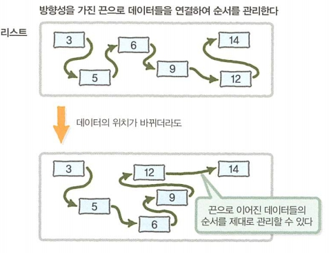
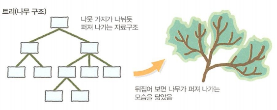

[ 19.11.22 ]

> 대량 데이터의 유지 관리 방법인 자료구조를 학습합니다.

 

# 제 3장. 자료구조
> ## 자료구조
대량 데이터를 효율적으로 관리하는 매커니즘 

> ## 대표적인 자료구조
### 배열
데이터를 빈틈없이 나열한 자료구조  
  
  
### 스택(STACK)
데이터를 쌓아서 관리하는 방식

  * PUSH: 데이터 넣기
  * POP: 데이터 꺼내기
  * LIFO(Last In, First Out) / FILO(First In, Last out): 마지막에 입력된 데이터가 먼저 출력 / 처음에 입력된 데이터가 마지막에 출력

   

  

### 큐(QUEUE, 대기 행렬)
먼저 입력한 데이터가 먼저 출력되는 특징을 가진 자료구조

  * FIFO(First In, First Out) / LILO(Last In, Last Out): 먼저 입력한 데이터가 먼저 출력 / 마지막에 입력한 데이터가 마지막에 출력

   

  

### 리스트
배열과 같이 차례대로 나열한 데이터를 관리 
  데이터들이 화살표로 서로 연결되어 있어 데이터들이 떨어진 장소에 위치 가능  
  

  * 단방향 리스트
  * 양방향 리스트
  
> #### 배열과 리스트
> * 1차원 배열: 차례대로 빈틈없이 나열, 데이터를 저장하는 상자들이 정해진 위치에 있으므로 데이터의 순서 파악 가능한 구조를 가짐
> * 리스트: 데이터들은 모두 떨어져 있지만, 끈으로 연결되어 있음, 데이터의 위치에 구애받지 않음,
> * N번째 요소의 참조가 빠른 것은 배열 / 느린 것은 리스트
> * 데이터의 삽입, 삭제가 빠른 것은 리스트 / 느린 것은 배열

> #### 링 버퍼
> 배열의 마지막 요소와 첫번째 요소를 연결시킨 자료구조
  
### 트리(나무 구조)
나무 가지처럼 퍼져 나가는 자료구조  
  

* 이진 트리
* 힙

> #### 뿌리와 잎, 그리고 깊이
> * 뿌리: 부모 없는 노드
> * 잎: 자식 없는 노드
> * 깊이: 뿌리에서 특정 노드에 도달하기까지의 경로의 길이

### 해시 테이블

### 그래프

 

***

## [ COLUMN ]
### 배열의 첫번째 요소 번호 0과 1
0과 1 두개의 케이스가 존재하는 이유는 첫번째 요소의 번호를 0으로 정한 프로그래밍 언어와 1로 정한 프로그래밍 언어가 존재하기 때문

* 컴퓨터 개발 초창기의 프로그래밍에 자주 사용되던 언어들 (배열의 첫번째 요소 번호: 1)
  * Fortran
  * Pascal
  * Basic(초기형)
* 그 후 주류가 되어 지금도 널리 이용되는 프로그래밍 언어들 (배열의 첫번째 요소 번호: 0)
  * C
  * C++
  * Java
  * C#
  * VisualBasic(BASIC)